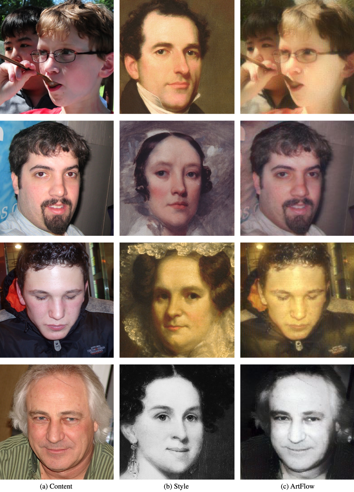
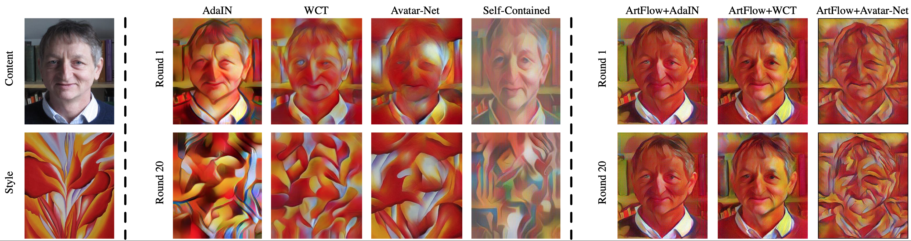

# ArtFlow
Official [PyTorch](https://pytorch.org) implementation of the paper:

[**ArtFlow: Unbiased Image Style Transfer via Reversible Neural Flows**](https://arxiv.org/abs/2103.16877)  
[Jie An<sup>*</sup>](https://www.cs.rochester.edu/u/jan6/), [Siyu Huang<sup>*</sup>](https://siyuhuang.github.io), [Yibing Song](https://ybsong00.github.io), [Dejing Dou](https://ix.cs.uoregon.edu/~dou/), [Wei Liu](https://sse.cuhk.edu.cn/en/faculty/liuwei) and [Jiebo Luo](https://www.cs.rochester.edu/u/jluo/)  
CVPR 2021

ArtFlow is a universal style transfer method that consists of reversible neural flows and an unbiased feature transfer module. ArtFlow adopts a projection-transfer-reversion scheme instead of the encoder-transfer-decoder to avoid the content leak issue of existing style transfer methods and consequently achieves unbiased style transfer in continuous style transfer.


## Style Transfer Examples
<p align='center'>
 
</p>


## Artistic Portrait Style Transfer Examples
We also train a model with the [FFHQ](https://github.com/NVlabs/ffhq-dataset) dataset as the content and [Metfaces](https://github.com/NVlabs/metfaces-dataset) as the style to convert a portrait photo into an artwork.
<p align='center'>
 
</p>

## Content Leak Phenomenon
When we continuously perform style transfer with a style transfer algorithm, the produced result will gradually lose the detail of the content image. The code in this repository solves this problem.

<p align='center'>
 
</p>


## Dependencies
* Python=3.6
* PyTorch=1.8.1
* CUDA=10.2
* cuDNN=7.6
* Scipy=1.5.2
 
Optionally, if you are a `conda` user, you can execute the following command in the directory of this repository to create a new environment with all dependencies installed.
```
conda env create -f environment.yaml
```

## Pretrained Models
If you want to use pretrained models to perform style transfer, please download the pre-trained models in [Google Drive](https://drive.google.com/drive/folders/1w2fHgSBYwjplfeCXI8eOGYpi69CpJBTE?usp=sharing) and put the downloaded `experiments` directory under the root of this repository. Then execute the following command in the root of the repository.

### Style Transfer
The command with the default settings is:
```
CUDA_VISIBLE_DEVICES=0 python3 -u test.py --content_dir data/content --style_dir data/style --size 256 --n_flow 8 --n_block 2 --operator adain --decoder experiments/ArtFlow-AdaIN/glow.pth --output output_ArtFlow-AdaIN
```

* `content_dir`: path for the content images. Default is `data/content`.
* `style_dir`: path for the style images. Default is `data/style`.
* `size`: image size for style transfer. Default is `256`.
* `n_flow`: number of the flow module used per block in the backbone network. Default is `8`.
* `n_block`: number of the block used in the backbone network. Default is `2`.
* `operator`: style transfer module. Options: `[adain, wct, decorator]`.
* `decoder`: path for the pre-trained model, if you let the `--operator wct`, then you should load the pre-trained model with `--decoder experiments/ArtFlow-WCT/glow.pth`. Otherwise, if you use AdaIN, you should set `--decoder experiments/ArtFlow-AdaIN/glow.pth`. If you want to use this code for portrait style transfer, please set `--operator adain` and `--decoder experiments/ArtFlow-AdaIN-Portrait/glow.pth`.
* `output`: path of the output directory. This code will produce a style transferred image for every content-style combination in your designated directories.

### Continuous Style Transfer
We provide a script to make style transfer with a content and a series of style images to demonstrate that our code can avoid the content leak issue. The command with the default settings is:
```
CUDA_VISIBLE_DEVICES=0 python3 continuous_transfer.py --content_dir data/content --style_dir data/style --size 256 --n_flow 8 --n_block 2 --operator adain --decoder experiments/ArtFlow-AdaIN/glow.pth --output output_ArtFlow-AdaIN
```
All parameters are the same as the style transfer part above.

## Testing
To test the style transfer performance of the pre-trained model with the given content and style images under `data` directory. Please run the following commands:
### ArtFlow + AdaIN
```
bash test_adain.sh
```
The style transfer results will be saved in `output_ArtFlow-AdaIN`.

### ArtFlow + WCT
```
bash test_wct.sh
```
The style transfer results will be saved in `output_ArtFlow-WCT`.

## Training
To train ArtFlow by yourself. Please firstly download the Imagenet pre-trained VGG19 model from [Google Drive](https://drive.google.com/drive/folders/1ecTshAlTsLf7i3oyN2ntyEPEeIoxUDu9?usp=sharing) and put the downloaded `models` directory under the root of the repository. Then run the following commands.
```
CUDA_VISIBLE_DEVICES=0,1 python3 -u train.py --content_dir $training_content_dir --style_dir $training_style_dir --n_flow 8 --n_block 2 --operator adain --save_dir $param_save_dir --batch_size 4
```

* `content_dir`: path for the training content images.
* `style_dir`: path for the training style images.
* `n_flow`: number of the flow module used per block in the backbone network. Default is `8`.
* `n_block`: number of the block used in the backbone network. Default is `2`.
* `operator`: style transfer module. Options: `[adain, wct, decorator]`.
* `save_dir`: path for saving the trained model.

The datasets we used for training in our experiments are as follows:

| Model | Content | Style |
| ---- | ---- | ---- |
| General | [MS_COCO](http://images.cocodataset.org/zips/train2014.zip) | [WikiArt](https://github.com/cs-chan/ArtGAN/tree/master/WikiArt%20Dataset) |
| Portrait | [FFHQ](https://github.com/NVlabs/ffhq-dataset) | [Metfaces](https://github.com/NVlabs/metfaces-dataset) |

If you want to reproduce the model in our experiments. Here are two bash scripts with our settings:
```
bash train_adain.sh
```
```
bash train_wct.sh
```
Please note that you may need to change the path of the train content and style datasets in the above two bash scripts.

## Citation
```
@inproceedings{artflow2021,
 title={ArtFlow: Unbiased image style transfer via reversible neural flows},
 author={An, Jie and Huang, Siyu and Song, Yibing and Dou, Dejing and Liu, Wei and Luo, Jiebo},
 booktitle={Proceedings of the IEEE/CVF Conference on Computer Vision and Pattern Recognition},
 year={2021}
}
```

## Acknowledgement
We thank the great work [glow-pytorch](https://github.com/rosinality/glow-pytorch), [AdaIN](https://github.com/xunhuang1995/AdaIN-style) and [WCT](https://github.com/Yijunmaverick/UniversalStyleTransfer) as we benefit a lot from their codes and papers.

## Contact
If you have any questions, please do not hesitate to contact <jan6@cs.rochester.edu> and <huangsiyutc@gmail.com>.

